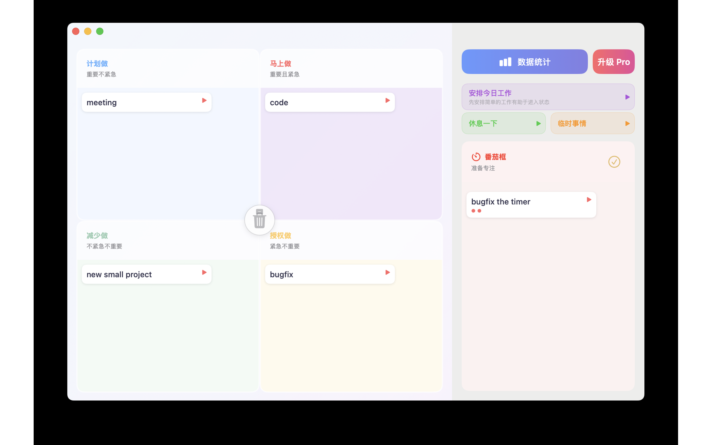
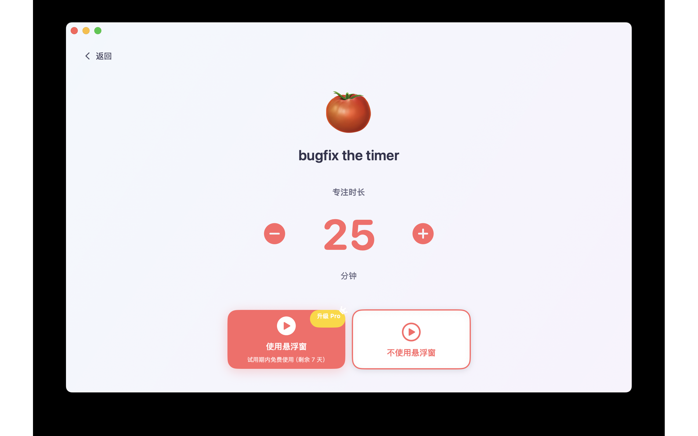
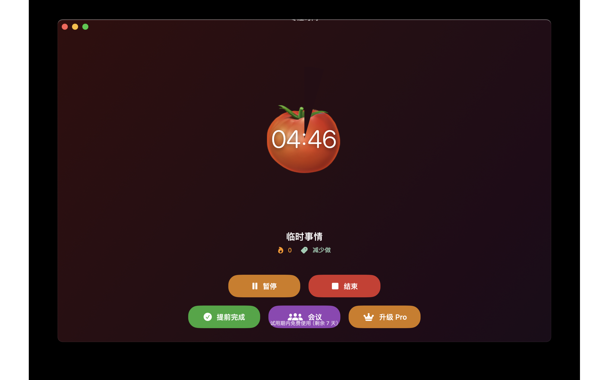
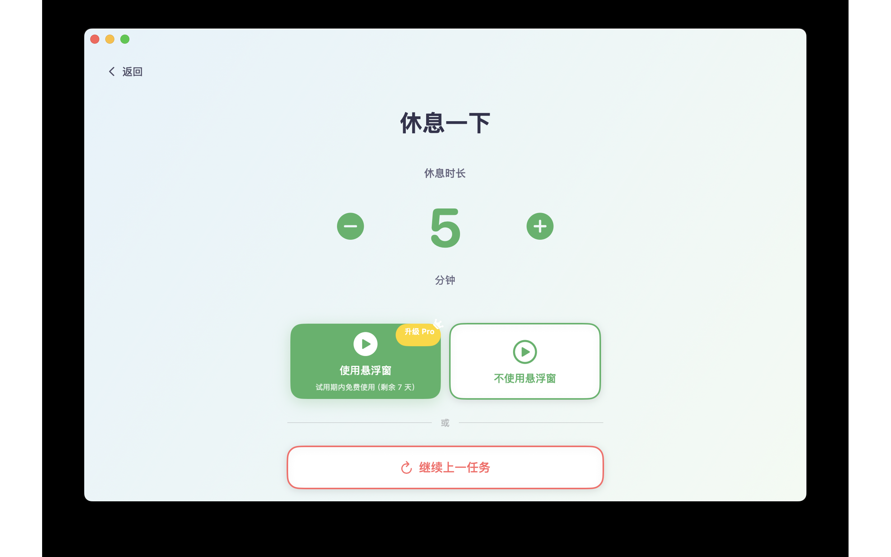
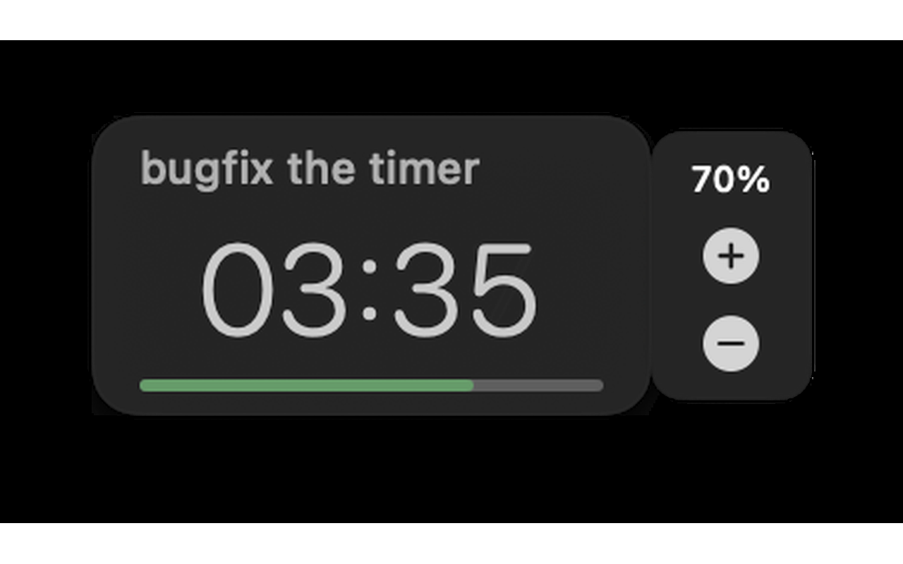
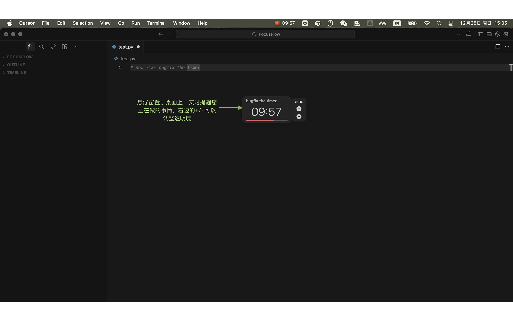

# FocusLoop 使用说明

## 简介

FocusLoop 是一款基于艾森豪威尔矩阵（四象限时间管理法）的番茄钟应用，帮助您高效管理任务并保持专注。通过将任务分类到不同象限，并使用番茄钟技术提升工作效率。

---

## 主要功能

### 1. 四象限任务管理

应用主界面采用艾森豪威尔矩阵，将任务分为四个象限：

- **Q1 - 马上做**（重要且紧急）：需要立即处理的重要任务
- **Q2 - 计划做**（重要不紧急）：需要规划的重要任务
- **Q3 - 授权做**（紧急不重要）：可以委托或快速处理的任务
- **Q4 - 减少做**（不紧急不重要）：应该减少或避免的任务

#### 添加任务
- 在每个象限的输入框中输入任务名称，按回车键添加
- 任务会自动保存到对应的象限中

#### 管理任务
- **拖拽移动**：将任务卡片拖拽到不同象限可以重新分类
- **删除任务**：将任务拖拽到中央的垃圾桶图标即可删除
- **完成任务**：将任务拖拽到番茄框右边的完成图标即可完成
- **开始番茄钟**：点击每个任务右边的开始按钮

---

### 2. 番茄钟功能

#### 2.1 开始专注

**方式一：从任务开始**
1. 点击任务卡片右边的开始按钮
2. 进入任务番茄钟设置页面
3. 设置专注时长（默认25分钟，可调整）
4. 选择启动方式：
   - **使用悬浮窗**：启动后主窗口会隐藏，显示悬浮计时器（Pro功能）
   - **不使用悬浮窗**：在主窗口显示倒计时

**方式二：快速操作**
- 点击右侧快速操作区的"安排今日工作"、"临时事情"等按钮快速开始。
- 强烈建议用户在每天早上"安排今日工作"

#### 2.2 专注倒计时页面

在倒计时页面，您可以：

- **查看进度**：番茄图标会显示倒计时进度
- **暂停/继续**：点击暂停按钮暂停计时，点击继续恢复
- **提前完成**：如果任务提前完成，点击"提前完成"按钮
- **临时会议**：如果中途需要开会，点击"会议"按钮切换到会议模式（Pro功能）
- **结束**：点击"结束"按钮终止当前专注时段

#### 2.3 休息时间

专注时段结束后，会自动进入休息设置页面：

- 设置休息时长（默认5分钟，可调整）
- 选择是否使用悬浮窗显示休息倒计时
- 点击"继续上一任务"可以继续之前的任务

#### 2.4 会议模式（Pro功能）

在专注或休息过程中，可以切换到会议模式：

- 会议模式会记录已过时间（正向计时）
- 会议结束后，点击"结束会议"返回主界面
- 会议时间会被记录到统计数据中

---

### 3. 悬浮窗功能（Pro功能）

悬浮窗是 FocusLoop 的 Pro 功能，让您在使用其他应用时也能看到计时器：

- **启动悬浮窗**：在设置页面选择"使用悬浮窗"启动
- **显示内容**：悬浮窗显示当前任务名称、剩余时间、进度条和模式
- **自动隐藏主窗口**：使用悬浮窗时，主窗口会自动隐藏，让您专注于工作
- **始终置顶**：悬浮窗会始终显示在其他应用窗口之上
- **调整透明度**：用户按照视觉偏好，调整透明度。在不过分干扰注意力的情况下，可以接收到悬浮窗的提醒作用

---

### 4. 快速操作

右侧快速操作区提供三个快捷按钮：

- **安排今日工作**：快速开始一个"安排今日工作"的番茄钟，帮助您进入工作状态
- **休息一下**：快速进入休息设置页面
- **临时事情**：快速开始一个"临时事情"的番茄钟

---

### 5. 数据统计（Pro功能）

点击主界面右上角的"数据统计"按钮，查看您的专注数据：
#### 今日完成
可以看到今天都完成了哪些任务

#### 今日统计
- **专注番茄钟数**：今天完成的专注时段数量
- **专注总时长**：今天累计专注时间
- **完成率**：完成和提前完成的专注时段占比
- **打断次数**：被暂停、终止或会议打断的次数

#### 本周统计
- **平均每日专注时长**：过去7天的平均专注时间
- **7天完成率平均**：过去7天的平均完成率
- **专注连续天数**：连续专注的天数
- **总打断次数**：过去7天的总打断次数

---

### 6. 设置

通过菜单栏的"FocusLoop" → "设置"打开设置页面：

#### 常规设置
- **语言**：切换应用语言（简体中文、繁体中文、English）

#### 计时器配置
- **专注时长**：设置默认专注时长（分钟）
- **短休息**：设置默认短休息时长（分钟）
- **长休息**：设置默认长休息时长（分钟）

---

## 使用技巧

### 1. 任务分类建议
- **Q1（马上做）**：紧急且重要的任务，如截止日期临近的项目
- **Q2（计划做）**：重要但不紧急的任务，如学习新技能、规划未来
- **Q3（授权做）**：紧急但不重要的任务，如回复邮件、处理琐事
- **Q4（减少做）**：不紧急且不重要的任务，如刷社交媒体、无意义的会议

### 2. 番茄钟工作法
- 专注25分钟，休息5分钟
- 每完成4个番茄钟，进行一次长休息（15-30分钟）
- 在专注时段内，避免被打断
- 如果被打断，可以暂停计时器，处理完后再继续

### 3. 提高效率
- 使用"安排今日工作"快速进入工作状态
- 将大任务拆分成多个番茄钟
- 利用统计数据了解自己的专注习惯
- 使用悬浮窗功能，避免频繁切换窗口

---

## Pro 功能

FocusLoop Pro 提供以下高级功能：

- ✅ **悬浮窗计时器**：在其他应用上显示计时器
- ✅ **会议模式**：记录临时会议时间
- ✅ **数据统计**：详细的专注数据分析
- ✅ **试用期**：新用户可免费试用

升级到 Pro 版本，解锁全部功能，提升工作效率！

---

## 常见问题

### Q: 如何删除任务？
A: 将任务卡片拖拽到主界面中央的垃圾桶图标即可删除。也可以右键删除

### Q: 悬浮窗不显示怎么办？
A: 悬浮窗是 Pro 功能，需要升级到 Pro 版本。试用用户也可以使用，但试用期结束后需要订阅。

### Q: 如何退出番茄钟？
A: 在倒计时页面点击"结束"按钮，或在设置页面点击"返回"按钮。

---

## 反馈与支持

如有问题或建议，请链接husfrank@gmail.com或者757583912@qq.com

---

**祝您使用愉快，专注高效！** 🍅✨

